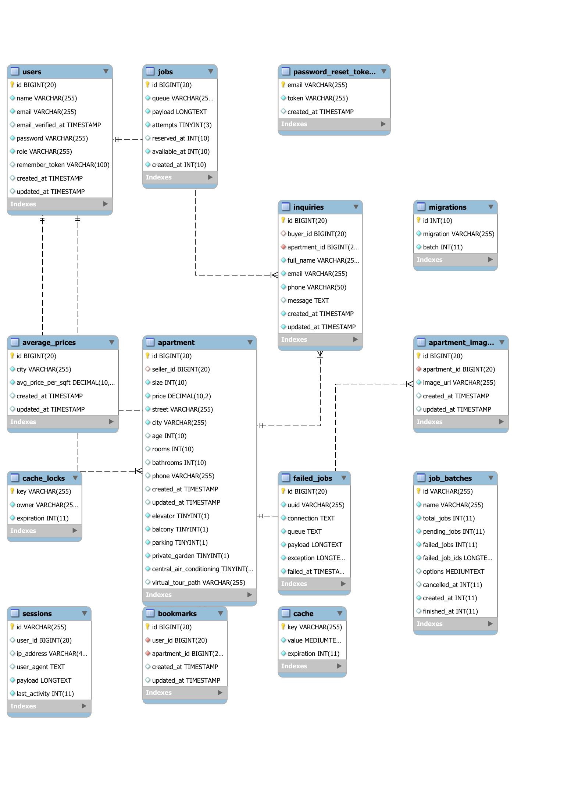

# docs/System Design

## System Design

This document explains the architecture, key components, data model, and infrastructure of the Real-Estate Platform.

***

### 1. Architectural Overview

| Layer           | Role                                                                                               |
| --------------- | -------------------------------------------------------------------------------------------------- |
| **Routes**      | Map URLs & HTTP verbs to controller methods (e.g. `GET /apartments` → `PropertyController@index`). |
| **Controllers** | Handle incoming requests: validate, call models, return views/JSON.                                |
| **Models**      | Eloquent classes (`User`, `Apartment`, `Bookmark`, etc.) defining tables & relationships.          |
| **Views**       | Blade templates producing HTML/CSS/JS for the user interface.                                      |

***

### 2. Key Controllers & Responsibilities

| Controller             | Core Methods                                                    | Summary                                      |
| ---------------------- | --------------------------------------------------------------- | -------------------------------------------- |
| **HomeController**     | `index`                                                         | Show homepage with featured listings         |
| **AuthController**     | `showLogin`, `login`, `showRegister`, `register`, `logout`      | Session-based auth via `Auth::attempt()`     |
| **PropertyController** | `index`, `show`, `create`, `store`, `edit`, `update`, `destroy` | CRUD for seller listings                     |
| **BookmarkController** | `store`, `destroy`                                              | Save / remove favourites                     |
| **InquiryController**  | `store`, `index`                                                | Buyers send messages; sellers view inquiries |
| **EstimateController** | `estimate`                                                      | Calculate suggested price based on inputs    |
| **SearchController**   | `search`, `results`                                             | Live search + JSON suggestions               |

> **Note:** All routes that change state are protected by Laravel’s built-in `auth` middleware (session guard).

***

### 3. Data Model & Relationships

#### 3.1 Tables

| Table                    | Key Columns & Purpose                                                                                                 |
| ------------------------ | --------------------------------------------------------------------------------------------------------------------- |
| `users`                  | `id`, `name`, `email`, `password`, `role` (`buyer`/`seller`), timestamps                                              |
| `apartments`             | `id`, `seller_id`, `size`, `price`, `street`, `city`, `rooms`, `bathrooms`, features, `virtual_tour_path`, timestamps |
| `apartment_images`       | `id`, `apartment_id`, `image_url`, timestamps                                                                         |
| `bookmarks`              | `id`, `user_id`, `apartment_id`, timestamps                                                                           |
| `inquiries`              | `id`, `buyer_id`, `apartment_id`, `full_name`, `email`, `phone`, `message`, timestamps                                |
| `average_prices`         | `id`, `city`, `avg_price_per_sqft`, timestamps                                                                        |
| `sessions`               | `id`, `user_id`, `payload`, `last_activity`                                                                           |
| `password_reset_tokens`  | `email`, `token`, `created_at`                                                                                        |
| **Queue & Cache Tables** | `jobs`, `job_batches`, `failed_jobs`, `cache`, `cache_locks`                                                          |
| **Framework Tables**     | `migrations`, etc.                                                                                                    |

#### 3.2 ER Diagram

Below is the visual ER diagram showing all tables and their foreign-key relationships:



**Figure:** ER diagram of the `real_estate` database schema.

***

### 4. Database & Connectivity

1. **Local database**\
   MySQL 8 via XAMPP (port 3306)
2. **Workbench**\
   Used to visualize schema and run queries
3.  **`.env` connection**

    ```dotenv
    DB_CONNECTION=mysql
    DB_HOST=127.0.0.1
    DB_PORT=3306
    DB_DATABASE=real_estate
    DB_USERNAME=root
    DB_PASSWORD=
    ```
