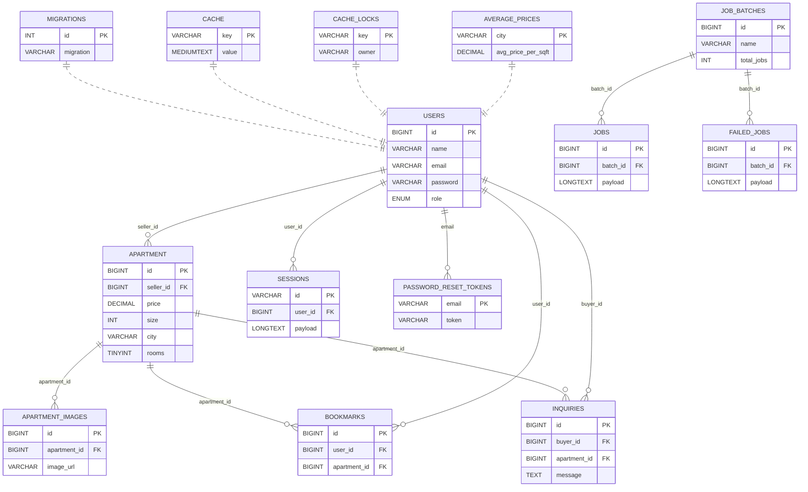

# docs/System Design

## System Design

This document explains the architecture, key components, data model, and infrastructure of the Real-Estate Platform.

***

### 1. Architectural Overview

| Layer           | Role                                                                                                                     |
| --------------- | ------------------------------------------------------------------------------------------------------------------------ |
| **Routes**      | Map URLs + HTTP verbs to controller methods (`Route::get`, `Route::post`, etc.).                                         |
| **Controllers** | Contain request handlers (e.g., `PropertyController@store`). Perform validation, call models, choose view/JSON response. |
| **Models**      | Eloquent classes (`Apartment`, `Bookmark`, `Inquiry`, etc.) that wrap DB tables and define relationships.                |
| **Views**       | Blade templates generating HTML/CSS/JS for the front-end.                                                                |

***

### 2. Key Controllers & Responsibilities

| Controller             | Core Methods                                               | Summary                                               |
| ---------------------- | ---------------------------------------------------------- | ----------------------------------------------------- |
| **HomeController**     | `index`                                                    | Homepage property listing + filters.                  |
| **AuthController**     | `showLogin`, `login`, `showRegister`, `register`, `logout` | Custom session-based authentication.                  |
| **PropertyController** | `create`, `store`, `show`, `update`                        | CRUD for property listings incl. image & tour upload. |
| **SellerController**   | `edit`, `destroy`, `destroyImage`                          | Seller-only listing management.                       |
| **BookmarkController** | `index`, `store`, `destroy`                                | Buyer favourites (many-to-many via `bookmarks`).      |
| **InquiryController**  | `store`, `index`                                           | Buyer → Seller messages + email notification.         |
| **CompareController**  | `show`, `updateComparison`                                 | Two-column property comparison with AJAX.             |
| **EstimateController** | `index`                                                    | Price estimator (form + result).                      |
| **SearchController**   | `search`, `showResults`                                    | Live search JSON & direct search redirect.            |

State-changing routes are protected by Laravel’s built-in `auth` middleware (session guard).

***

### 3. Data Model & Relationships

#### 3.1 Tables

| Table              | Purpose (main columns)                                                                                         |
| ------------------ | -------------------------------------------------------------------------------------------------------------- |
| `users`            | `id`, `name`, `email`, `password`, `role` (`buyer` / `seller`)                                                 |
| `apartment`        | `id`, `seller_id`, `price`, `size`, `street`, `city`, `rooms`, `bathrooms`, amenity flags, `virtual_tour_path` |
| `apartment_images` | `id`, `apartment_id`, `image_url`                                                                              |
| `bookmarks`        | `id`, `user_id`, `apartment_id`                                                                                |
| `inquiries`        | `id`, `buyer_id`, `apartment_id`, `message`                                                                    |
| `average_prices`   | `city`, `avg_price_per_sqft`                                                                                   |
| _framework_        | `jobs`, `job_batches`, `sessions`, `migrations`, etc.                                                          |

#### 3.2 ER Diagram (text view)

***

### 4. Database & Connectivity

1. **Local database:** MySQL 8 via **XAMPP** (port 3306).
2. **Workbench:** Used to visualise schema and run queries.
3.  **`.env` connection:**

    ```dotenv
    DB_CONNECTION=mysql
    DB_HOST=127.0.0.1
    DB_PORT=3306
    DB_DATABASE=real_estate
    DB_USERNAME=root
    DB_PASSWORD=
    ```


