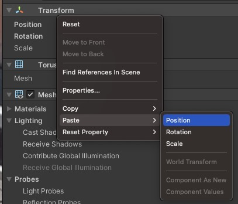

# docs/Unity

## Unity Virtual Reality Tour

This guide walks you through creating a professional VR tour in Unity, using the **XR Interaction Toolkit** and a custom **Virtual Tour SDK**. You will:

* Configure Unity for VR
* Import the Virtual Tour SDK
* Set up a scene with interactive hotspots
* Implement a teleportation script
* Build the final VR application

***

### Table of Contents

1. Introduction
2. Prerequisites
3. Project Setup
   * Create a New Unity Project
   * Install XR Plugin Management
   * Import the Virtual Tour SDK
4. Scene Configuration
   * Configure the XR Rig
   * Add Waypoints
   * Set Up Hotspots
5. Scripting Teleportation
   * TeleportToRoom.cs
   * Code Breakdown
6. Building the Project
7. Conclusion

***

### Introduction

Build an interactive VR tour that lets users click (or gaze) on hotspots to move seamlessly between scenes. This guide covers everything from initial setup to final build.

***

### Prerequisites

* **Unity Editor** (2021.3 LTS or later) via _Unity Hub_\
  &#xNAN;_&#x49;nclude platform modules for your target (Windows, Android, etc.)_
* **XR Plugin Management** & **XR Interaction Toolkit** (via Package Manager)
* **VR Headset** compatible with your platform
* **Virtual Tour SDK** package (`.unitypackage`)

***

### Project Setup

#### Create a New Unity Project

1. Open **Unity Hub** → **New**
2. Choose **3D (URP)** or **3D** template
3. Name it `VRVirtualTour` and set your project location
4. Click **Create Project**

#### Install XR Plugin Management

1. **Window** → **Package Manager**
2. Install **XR Plugin Management** and **XR Interaction Toolkit**


3. **Edit** → **Project Settings** → **XR Plug-in Management**
4. Enable your platform loader (e.g., **Oculus**, **Windows XR**)

#### Import the Virtual Tour SDK

1. **Assets** → **Import Package** → **Custom Package…**
2. Select `VirtualTourSDK.unitypackage`
3. Click **Import**


***

### Scene Configuration

#### Configure the XR Rig

1. In the **Hierarchy**, delete **Main Camera**
2. Drag **XR Rig** prefab from `Assets/VirtualTourSDK/Prefabs` into the scene
3. Set its **Transform** to `(0, 0, 0)`
4. In **Inspector**, set **Tracking Origin** = **Floor**


#### Add Waypoints

1. **Hierarchy** → **Create Empty** → rename to `Waypoint_A`
2. Position at your scene’s entry (e.g., `(2, 0, 5)`)
3. Repeat for `Waypoint_B`, `Waypoint_C`, …
4. _(Optional)_ Add a small sphere or icon for visibility


#### Set Up Hotspots

1. Under each waypoint → **Create Empty** → rename to `Hotspot`
2. Attach a 3D model or UI icon
3. Add **Box Collider** → check **Is Trigger**
4. Attach the **TeleportToRoom** script
5. In **Inspector**, set **Target Scene**, **Entry Position**, **Entry Rotation**


<figure><figcaption></figcaption></figure>

***

### Scripting Teleportation

#### TeleportToRoom.cs

Create **`Assets/Scripts/TeleportToRoom.cs`**:


```csharp
using UnityEngine;
using UnityEngine.SceneManagement;
using System.Collections;

public class TeleportToRoom : MonoBehaviour
{
    [Header("Teleport Settings")]
    public string   targetScene;    // Scene to load
    public Vector3  entryPosition;  // Player position after load
    public Vector3  entryRotation;  // Player rotation after load

    private bool isLoading = false;

    void Update()
    {
        if (!isLoading && Input.GetKeyDown(KeyCode.T))
            StartCoroutine(LoadAndTeleport());
    }

    void OnMouseDown()
    {
        if (!isLoading)
            StartCoroutine(LoadAndTeleport());
    }

    private IEnumerator LoadAndTeleport()
    {
        isLoading = true;
        var asyncLoad = SceneManager.LoadSceneAsync(targetScene);
        while (!asyncLoad.isDone) yield return null;

        var xrRig = FindObjectOfType<XRRig>();
        if (xrRig != null)
        {
            xrRig.transform.position    = entryPosition;
            xrRig.transform.eulerAngles = entryRotation;
        }
        isLoading = false;
    }
}
```

***

### Building the Project

1. **File** → **Build Settings**
2. Add all VR scenes to **Scenes In Build**


3. Select your target platform → click **Switch Platform**


4. In **Player Settings**, verify **XR Plug-in Management** and graphics API


5. Click **Build** or **Build And Run**, then choose an output folder


***

### Conclusion

You now have a fully functional VR tour with clickable hotspots and smooth teleportation. Next steps could include:

* **Audio narration** per room\
  
* **Gaze-based UI**\
  
* **Analytics** to track user movement\
  
